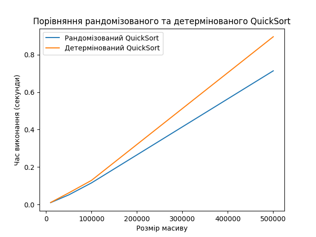

# Алгоритмічна складність, наближені та рандомізовані алгоритми

**Завдання 1. Порівняння рандомізованого та детермінованого QuickSort**

Реалізуйте рандомізований та детермінований алгоритми сортування QuickSort. Проведіть порівняльний аналіз їхньої ефективності, вимірявши середній час виконання на масивах різного розміру.

**Технічні умови**

1. Для реалізації рандомізованого алгоритму QuickSort реалізуйте функцію `randomized_quick_sort(arr)`, де опорний елемент (pivot) обирається випадковим чином.

2. Для реалізації детермінованого алгоритму QuickSort реалізуйте функцію `deterministic_quick_sort(arr)`, де опорний елемент обирається за фіксованим правилом: перший, останній або середній елемент.

3. Створіть набір тестових масивів різного розміру: `10_000`, `50_000`, `100_000` та `500_000` елементів. Заповніть масиви випадковими цілими числами.

4. Виміряйте час виконання обох алгоритмів на кожному масиві. Для більш точної оцінки повторіть сортування кожного масиву 5 разів та обчисліть середній час виконання.

**Критерії прийняття**

1. Функції `randomized_quick_sort` та `deterministic_quick_sort` реалізують алгоритми сортування та сортують масиви (20 балів).

2. Час виконання алгоритмів виміряний та представлений у вигляді таблиці та графіка (10 балів).

3. Побудовано графіки, з підписами осей та легендою (5 балів).

4. Проведено аналіз результатів та зроблено висновки щодо ефективності рандомізованого та детермінованого QuickSort (10 балів).

5. Код виконує приклад використання та відповідає очікуваним результатам (5 балів).

## Рішення 1

[quick_sort.py](quick_sort.py)



```py
Розмір масиву: 10_000
   Рандомізований QuickSort: 0.0101 секунд
   Детермінований QuickSort: 0.0108 секунд
Розмір масиву: 50_000
   Рандомізований QuickSort: 0.0515 секунд
   Детермінований QuickSort: 0.0623 секунд
Розмір масиву: 100_000
   Рандомізований QuickSort: 0.1156 секунд
   Детермінований QuickSort: 0.1291 секунд
Розмір масиву: 500_000
   Рандомізований QuickSort: 0.7139 секунд
   Детермінований QuickSort: 0.8959 секунд
```

В середньому, рандомізований QuickSort показує кращий час ніж детермінований із середнім pivot-елементом.
